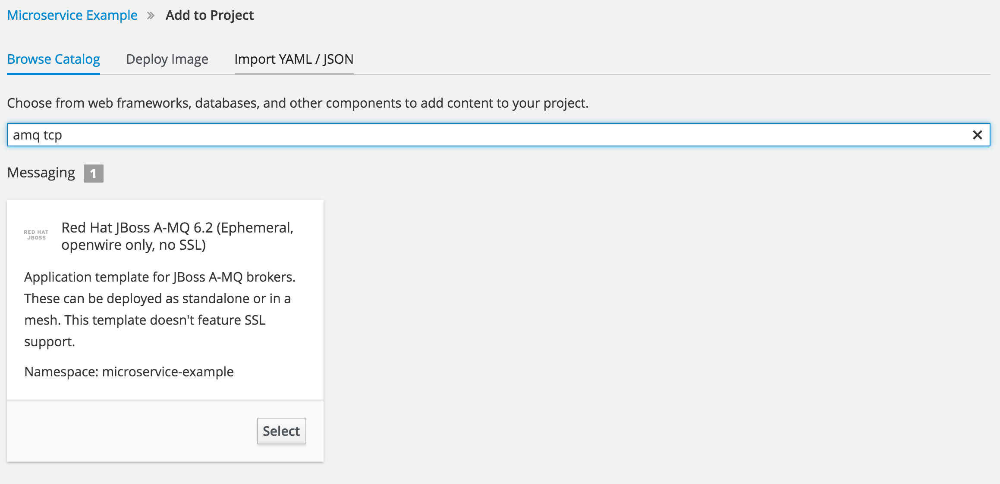

# Spring Boot and Camel websocket

## Building

The example can be built with

```
mvn clean install
```    
## Running the example with maven

*NOTE:* for this example you need a running amq on your environment
    
```    
mvn spring-boot:run -s <path_to_setting>
```

eg:

```    
mvn spring-boot:run -s ../settings.xml
```

# Running the example in OpenShift

## AMQ setup

In the templates dir there is a simple template for:

* A-MQ 6.2
* Ephemeral
* openwire protocol only (on port 61616)
* no SSL

To import the template do:

```
oc create -f templates/amq62-basic-tcp.json
```

### Create the broker from template

After the template is imported, we can use it to create the service: check if all the default values are present.



## Create the alert service

Create the application from s2i (default values match with amq tempaltes).

## Testing the websocket

